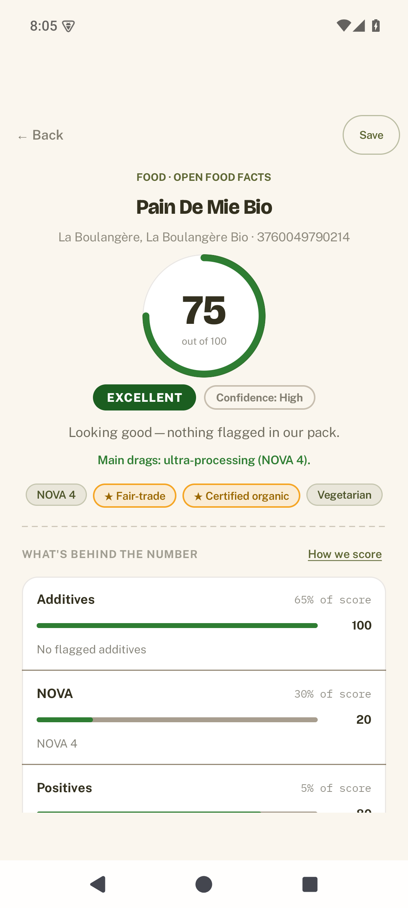
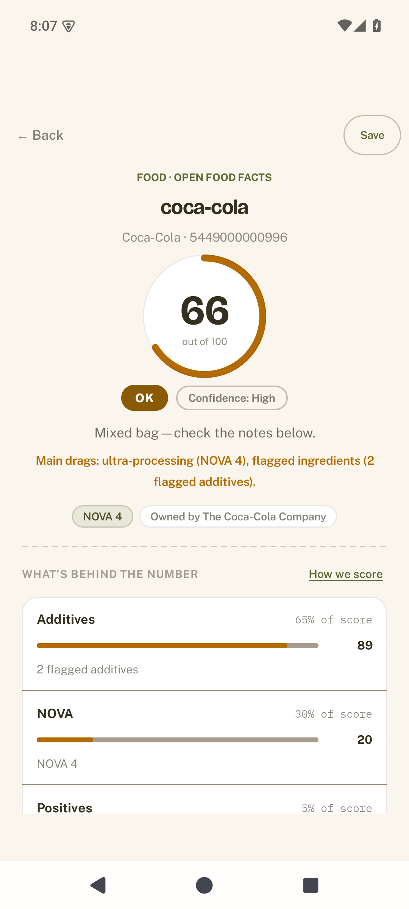
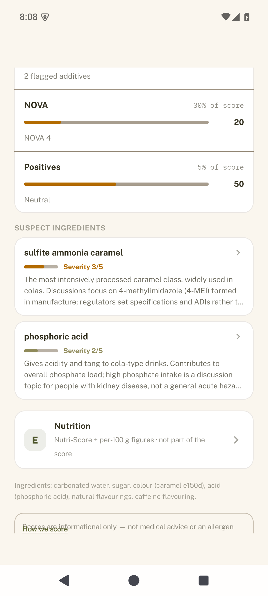
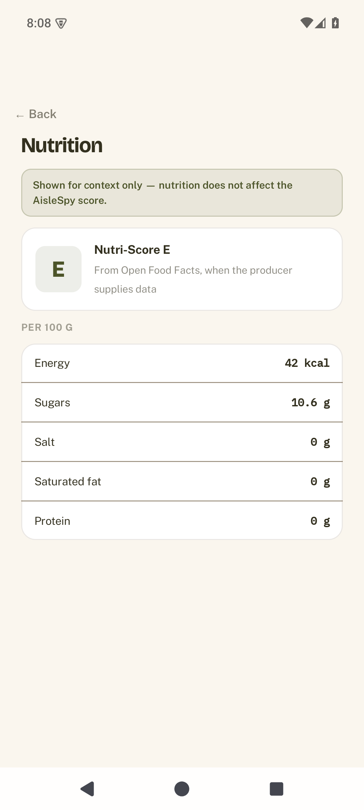
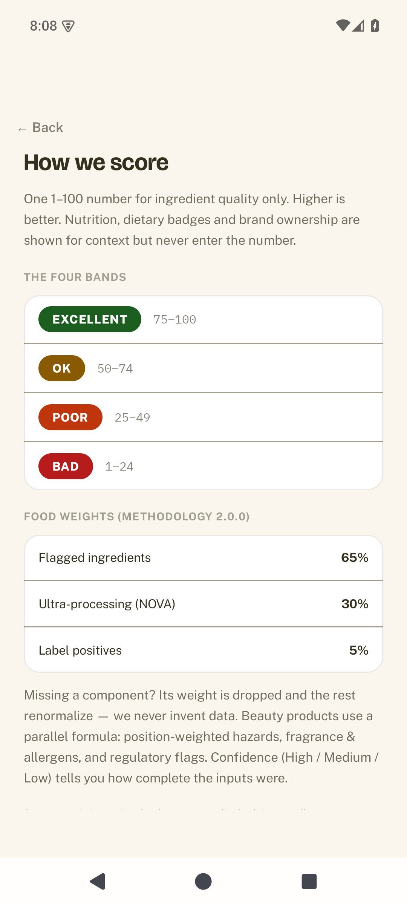
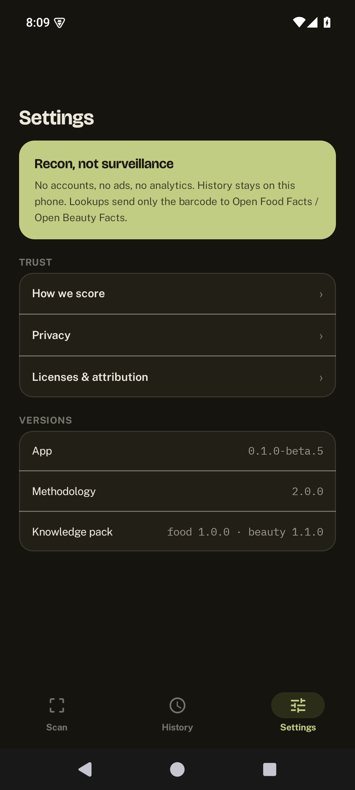

# AisleSpy

**What’s really in the aisle.**

AisleSpy is a **privacy-first** Android app that scans food and beauty barcodes, looks them up in open product databases, and shows a clear **1–100 ingredient-quality score** plus plain-language notes on flagged ingredients. History stays on your device. No accounts. No tracking SDKs.

---

## Screenshots

<table>
  <tr>
    <td align="center" width="16%"> Score at a glance</td>
    <td align="center" width="16%"> Product result</td>
    <td align="center" width="16%"> Suspect ingredients</td>
    <td align="center" width="16%"> Nutrition (separate)</td>
    <td align="center" width="16%"> How we score</td>
    <td align="center" width="16%"> Dark mode</td>
  </tr>
</table>

---

## Features

- **Barcode scan** (CameraX + zxing-cpp, no Google Play Services) and **manual entry**
- **Dual lookup** in [Open Food Facts](https://world.openfoodfacts.org/) and [Open Beauty Facts](https://world.openbeautyfacts.org/), with a category chooser when needed
- **Food and beauty scoring** with confidence and honest “not enough data” states
- **1–100 ingredient-quality score** (higher is better) and four clear bands: Excellent / Ok / Poor / Bad
- **Ranked suspect ingredients** — severity 1–5, plain-language why, and sources
- **Separate nutrition screen** (Nutri-Score + per-100g) — nutrition never changes the score
- **Informational badges** (shown, never scored): dietary (vegan / vegetarian / dairy-free), certifications & values (organic, fair-trade, cruelty-free, and more), and brand ownership (“Owned by …” vs verified Independent)
- **On-device scan history** and a short-lived product cache
- **Onboarding, settings, and trust pages** so methodology and privacy stay transparent
- **Warm light + dark theme** that follows the system setting
- **Accessibility**: TalkBack, large fonts, reduce motion

---

## How the score works

The primary **1–100** number is about **ingredient quality only** (methodology 2.0.0):

| Share | What it covers |
|------:|----------------|
| 65% | Flagged ingredients from our open knowledge packs |
| 30% | Ultra-processing / NOVA (food) |
| 5% | Label positives (e.g. organic, fair-trade) |

Scores fall into four bands: **Excellent** (75–100), **Ok** (50–74), **Poor** (25–49), **Bad** (1–24). When product data is thin, AisleSpy shows confidence and may withhold a number rather than invent one.

**Nutrition** (Nutri-Score, per-100g values) lives on its own screen and **does not affect the score**. Dietary, certification, and brand-ownership badges are informational only.

Full formulas, severity rules, and version history: [docs/SCORING.md](docs/SCORING.md).

---

## Install

**Requirements:** Android 8.0+ (API 26). No Google Play Services required.

### Recommended: Obtainium (auto-updates from GitHub Releases)

[Obtainium](https://github.com/ImranR98/Obtainium) is the easiest way to stay updated without an app store. It watches this repo’s releases and installs new APKs when they ship.

1. Install [Obtainium](https://github.com/ImranR98/Obtainium).
2. Open **Add App** and enter the source URL: `https://github.com/neon798/aislespy`
3. Obtainium finds the latest release and the `aislespy-<version>.apk` asset.
4. Install from Obtainium; it will notify you and update when a new release is published.

### Manual: download APK + verify

1. Open the **Releases** page of this repository (on GitHub: *Releases* in the repo sidebar / under the Code tab).
2. Download the latest signed APK (currently in the **v0.1.0-beta.x** line) and its **SHA-256** checksum.
3. Verify the hash, then install via your device’s package installer (sideload) or `adb install`.

**Distribution:** GitHub Releases (canonical) + Obtainium now; a self-hosted F-Droid repo is planned; F-Droid.org main is under consideration later. AisleSpy is **not** listed on F-Droid.org or any third-party app store. Maintainer notes: [docs/DISTRIBUTION.md](docs/DISTRIBUTION.md).

---

## Privacy

- No accounts, no cloud sync
- No analytics or advertising SDKs in the default build
- Scan history and cache stay **on your device**
- Looking up a product sends only the **barcode** (plus normal HTTPS metadata) to Open Food Facts and/or Open Beauty Facts

Details: [PRIVACY.md](PRIVACY.md).

---

## Not medical advice

AisleSpy scores and ingredient notes are **informational tools for reading labels**. They are **not** medical advice, allergen guarantees, or safety certifications. Always check the physical package and consult professionals for health decisions.

---

## Data & licensing

| What | License / terms |
|------|-----------------|
| App source code | [Apache License 2.0](LICENSE) |
| Authored knowledge packs | Apache-2.0 (with the app) |
| Product data (OFF / OBF) | © contributors, [Open Database License (ODbL)](https://opendatacommons.org/licenses/odbl/) |
| Bundled fonts (Bricolage Grotesque, Public Sans, IBM Plex Mono) | SIL Open Font License (OFL) |

Attribution for product databases:

> Product data © Open Food Facts / Open Beauty Facts contributors, available under the Open Database License.  
> https://world.openfoodfacts.org · https://world.openbeautyfacts.org

More detail: [docs/DATA_SOURCES.md](docs/DATA_SOURCES.md).

---

## Contributing & development

Want to contribute code, docs, or knowledge packs? Start with **[CONTRIBUTING.md](CONTRIBUTING.md)**.

For technical architecture, agent handoff, and the full docs tree, see **[AGENTS.md](AGENTS.md)** and the **[docs/](docs/)** folder (product, scoring, UI, verification, distribution).
